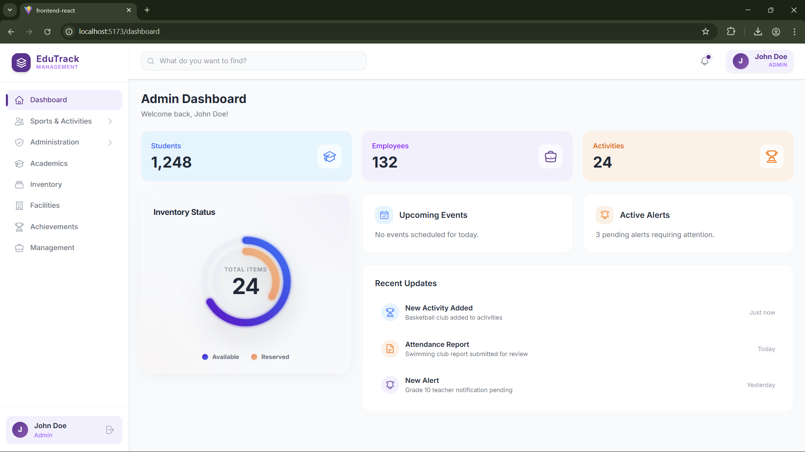
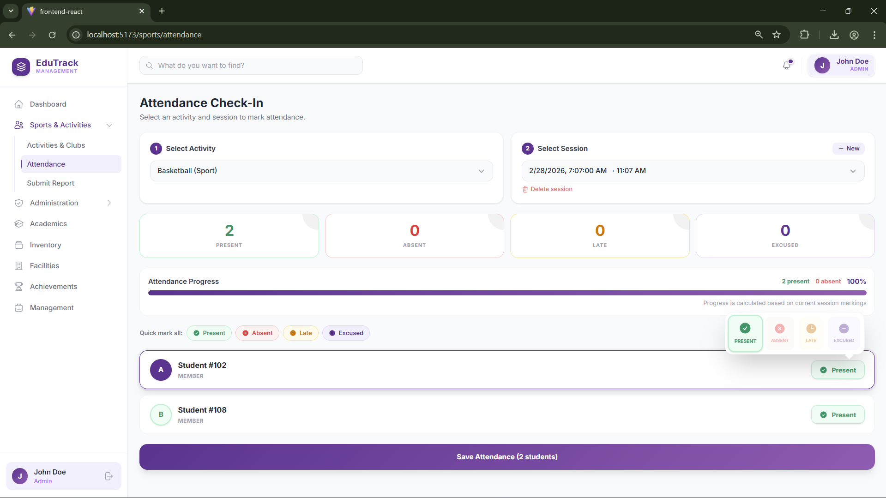
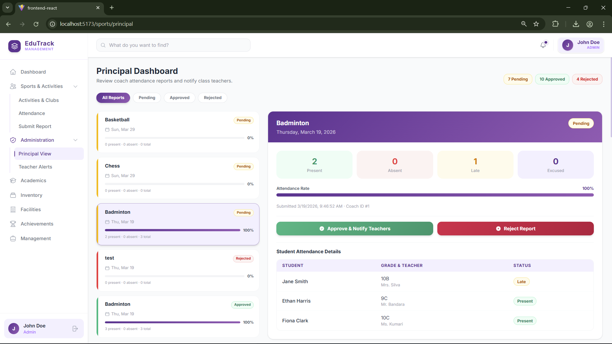
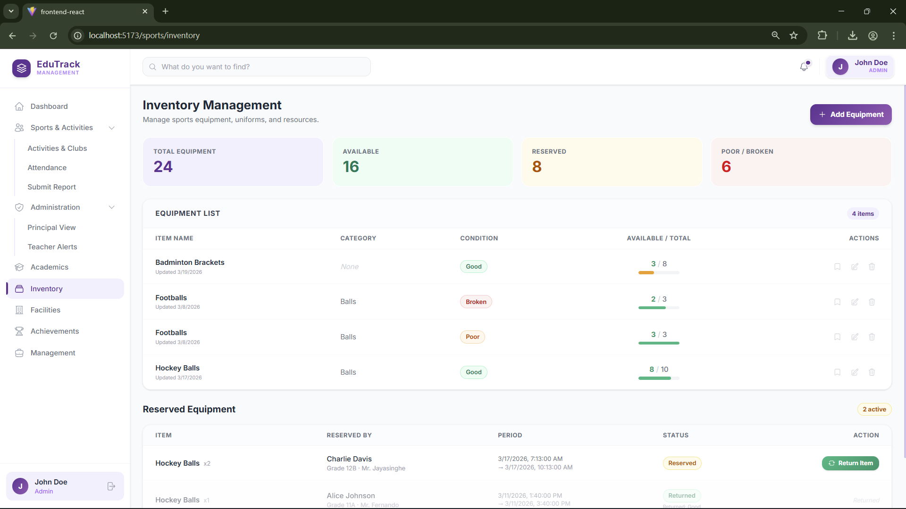
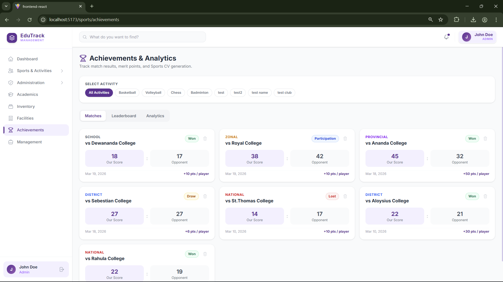
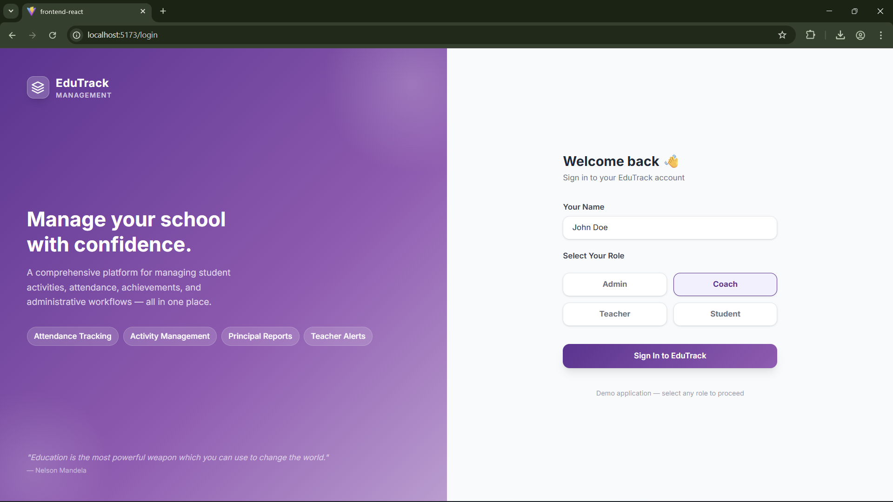

# EduTrack - School Management System 🎓

EduTrack is a modern, premium school management platform designed to streamline administrative workflows, enhance student tracking, and improve communication across the educational ecosystem.

---

## 🏆 Sport Management Module

The Sport Management module is a comprehensive suite designed for physical education departments to manage activities, attendance, inventory, and reporting with administrative oversight.

### 📊 Dashboard & Analytics

*FIgure 1: Sport Dashboard with live analytics and notifications*

*   **Dynamic Analytics**: Interactive graphs for tracking student Merit Points with filters for **Activity** and **Time Period** (Weekly, Monthly, Yearly).
*   **Role-Based Views**: Tailored dashboard experiences for Admins, Coaches, Teachers, and Students.
*   **Administrative Oversight**: Quick-view stats for pending reports, approved achievements, and critical alerts.

### 📅 Attendance Check-In System

*Figure 2: Student attendance list for each session showing the color-coded popover menu (Present/Absent/Late/Excused).*

*   **Session Management**: Create and track specific practice sessions with high-precision timestamps.
*   **Color-Coded Status Popover**: A lightning-fast individual marking system designed for coaches on the field.
*   **Bulk Actions**: "Quick mark all" functionality and live progress visualization.
*   **Safety Confirmations**: Confirmation modals on saving attendance to ensure data integrity.

### 📝 Strategic Reporting Pipeline

*Description: Principal's Dashboard showing the pending reports list and the Approve/Reject workflow.*

*   **Daily Reports**: Automated generation of attendance summaries for specific activities.
*   **Principal's Approval Board**: A dedicated workflow for the Principal to review, approve, or reject coach-submitted reports.
*   **Rejection Workflows**: Mandatory confirmation steps for report rejections to prevent administrative errors.
*   **Teacher Notifications**: Automatic alerts sent to class teachers when their students are marked absent or excused.

### 📦 Inventory & Equipment Management

*Description: Inventory reservation dashboard.*

*   **Equipment Tracking**: Real-time status monitoring (New, Good, Fair, Poor, Broken).
*   **Borrowing Logs**: Detailed records of equipment usage.
*   **Student Reservations**: Advanced reservation system including student name, class, grade, and teacher details for accountability.

### 🏅 Achievements & Leaderboards

*Description: Student matches, leaderboard and analytics.*

*   **Event Logging**: Record matches, tournaments, and inter-school competitions.
*   **Performance Tracking**: Track scores, opponents, levels (School to National), and participants.
*   **Live Leaderboards**: Student rankings based on merit points earned through attendance and achievement.

---

## 🔒 Security & Session Integrity

*Description: Login page showing role selection pills (Admin/Coach/Teacher/Student).*

*   **Protected Routes**: Robust navigation security using `ProtectedRoute` to enforce authentication.
*   **Immediate Redirection**: Zero-flicker redirection to login for unauthenticated attempts.
*   **Target Memory**: After logging in, users are automatically taken back to their intended destination.
*   **Session Failsafe**: Automatic logout if the backend server becomes unreachable.

---

## 🛠️ Technology Stack
*   **Frontend**: React (Vite), TypeScript, TailwindCSS, Framer Motion, TanStack Query (React Query).
*   **Backend**: Node.js, Express, TypeScript.
*   **Icons**: Heroicons.
*   **Authentication**: Custom role-based session management.

---

## 🚀 Getting Started

### Prerequisites
*   Node.js (v18+)
*   npm or yarn

### Installation
1.  **Clone the Repository**
    ```bash
    git clone https://github.com/it24104383Kalhara/EduTrack.git
    ```
2.  **Frontend Setup**
    ```bash
    cd frontend
    npm install
    npm run dev
    ```
3.  **Backend Setup**
    ```bash
    cd backend
    npm install
    npm run dev
    ```

---

## 📂 Project Structure
*   `/frontend`: Modern UI built for speed and responsiveness.
*   `/backend`: Robust API architecture with role-based middleware.
*   `/docs`: Detailed API and implementation documentation.

---
*Developed for EduTrack Schools Management Ecosystem.*